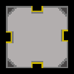

# RageQuit(?) - Godot 4.2 Game

#### 2D Pixellated Platform Game

Or click on this <a href="https://www.shorturl.at/ILP58" target="_blank">link!</a> - short version (shorturl.at/ILP58)

## Summary (One Sentence)

This game is supposed to make the player as angry as possible by screwing up with him in various ways. 

## Detailed Summary

You will play as a small pixelated character and your only purpouse is to get into the portal to progress to another level. The whole map is suited to screw with you as much as possible so it wont be that easy. Each level is specific in it's own way and can make you mad totally different than the previous ones.

## Pillars of Design

Funny, Mad, Anger, Platform, Jumping

## Story

### Setting

The main character is called Frederique and his only way to escape the horryfying repeating leves are to jump into portal. But the surrounding will not let him escape that easily. He has to think of his every move so he doesn't end up over and over again at the start.

### World

    

### Characters

    
    
    
    
    

## Gameplay Structure

The main requirement is to have a nerves of steel and some computer to play on and maybe to destroy too.

### Game Play Loop

The player will play level after level to achive his goal whitch is represented as portal/gate at end of each level. If he succes in approaching the gate the game will open next level for playing.

### Controls

Keyboard / Mouse

### Gameplay Mechanics

In this game are multiple mechanics, that will kill you or make something happen that can screw up with you. The main mechanics are:

1. Gate/Portal
1. Spikes
1. Sawblade
1. Buttons
1. Moving platforms

    
    
    
    

## Art and Sound

### Graphics Requirements

This game is pixellated so you won't need any high end PC to run this game.

### Sound

We use sounds that Donald Trump made to give the game a funny vibe so you don't break your PC so fast. The sounds are from this webside - <a href="https://www.myinstants.com/en/index/us/" target="_blank">Myinstants!</a>

For background music we used Elevator Music from Kevin MacLeod that you can find <a href="https://www.youtube.com/watch?v=xy_NKN75Jhw" target="_blank">here</a>.

## UI

### Main menu

    

#### Components of Main menu

    
    
    
    

### Settings

    

#### Components of Main menu

    
    

    
    
    

## Development Tools

1. Godot
2. Pixelorama

## Team

- Petr Nagy
- Mikuláš Mikeska
